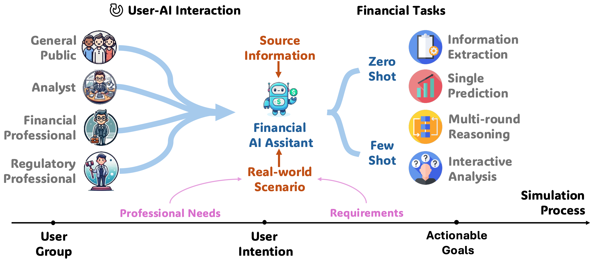

# UCFE: A User-Centric Financial Expertise Benchmark for Large Language Models

## Overview

The **UCFE Benchmark** provides a user-centric framework for evaluating the performance of large language models (LLMs) in complex financial tasks. The complete benchmark dataset is available in `UCFE_bench.json`.

## How to Run the Simulator

Follow these steps to set up and run the simulator:

1. Set your API key in the `config` folder.
2. Run the simulator with the following command: `python run_ckpt.py`

## How to Evaluate the Model

You can evaluate individual models or run evaluations for all models:

1. Evaluate for a single model: `bash scripts/eval_model.sh`
2. Evaluate for all models: `bash scripts/eval_all.sh`